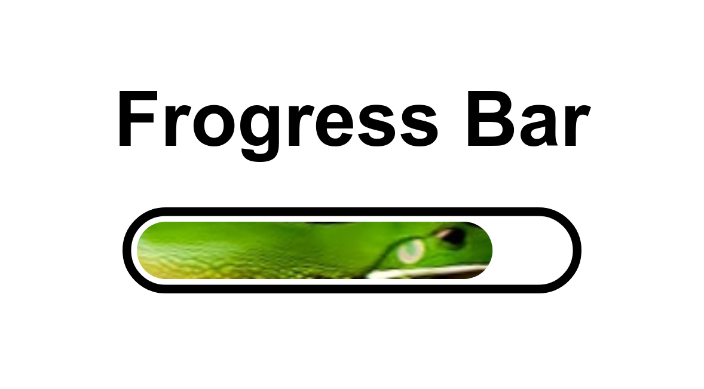

# frogress
A progress bar, but with a Frog.



## Usage

### With Plain HTML

Copy the contents of [Frogress.html](/Frogress.html) into your HTML file and set the CSS variable `--progress` with JS, like this:

```html
<!-- Styles are ommited in this example -->
<div id="frogressbar"> 
    <div></div>
</div>

<script>
    let random = () => Math.floor(Math.random()*100)
    let update = () => document.querySelector("#frogressbar").style = `--progress: ${random()}%`
</script>

<button onclick="update()">Update</button>
```

An implementation is the [website](https://frogress.ml) ([source code](/index.html)).

### With Svelte

Download the [Frogress.svelte](/Frogress.svelte) file and use it like this:

```html
<script>
	import Frogress from "./Frogress.svelte"
	let value = 50;
    let random = () => Math.floor(Math.random()*100)
    let update = () => value = random()
</script>

<Frogress progress={value}/>

<button on:click={update}>Update</button>
```

An implementation can be found as a [Svelte REPL](https://svelte.dev/repl/091d82239c7344299e296b8149546b52?version=3.42.3).